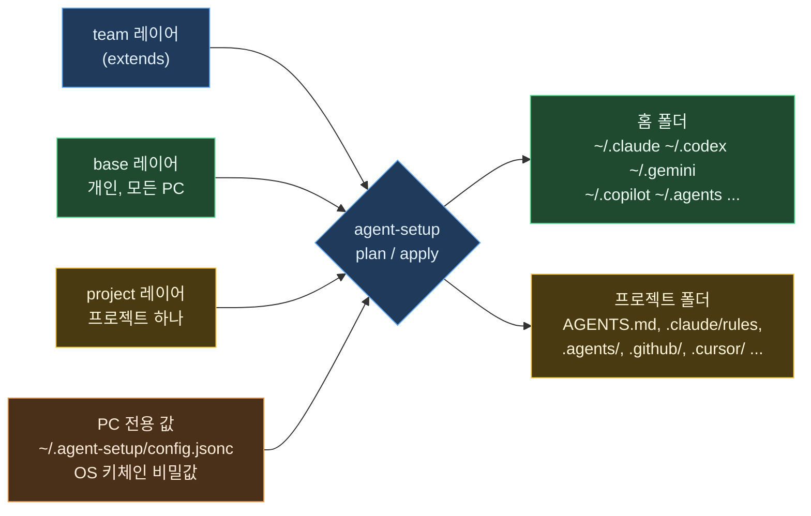

# agent-setup

여러 AI 코딩 에이전트의 설정을 git 저장소 하나에 모아 두고, 어느 PC에서든 명령 한 번으로 같은 환경을 구성하는 도구입니다.

- **base 레이어**: 모든 PC에 따라가는 개인 설정입니다. 작업 규칙, 스킬, 슬래시 명령, MCP 서버, 도구별 설정이 여기에 들어갑니다.
- **project 레이어**: 프로젝트 폴더 하나에만 적용하고, 프로젝트가 끝나면 폐기하는 설정입니다.
- **PC 전용 값**: 경로와 비밀값처럼 PC마다 다른 값입니다. 저장소에는 들어가지 않습니다.

원본 하나를 Claude Code, OpenAI Codex, Gemini CLI, Google Antigravity, GitHub Copilot, Cursor, OpenCode, Zed, Junie, Kiro, Amp, Factory Droid, Devin, Qwen Code, Cline, Goose가 각자 읽는 파일 형식으로 변환합니다. 에이전트가 스스로 다시 쓰는 파일(`~/.codex/config.toml`, `~/.gemini/settings.json`, `~/.claude.json`)은 통째로 덮어쓰지 않고, agent-setup이 관리하는 키와 블록만 병합합니다.

외부 의존성은 없고 Node.js 18.17 이상에서 동작합니다. Windows, macOS, Linux, WSL을 지원합니다.

처음 쓰는 분은 [처음 사용자 가이드](docs/GUIDE.ko.md)부터 읽으십시오. 설치부터 매일 쓰는 방법까지 순서대로 정리되어 있습니다.

## 해결하는 문제

| 문제 | agent-setup의 처리 방식 |
|---|---|
| 에이전트마다 지시문, 스킬, MCP 서버를 읽는 위치와 형식이 다르다 | 중립 형식의 원본 하나를 도구별 형식으로 변환한다 (AGENTS.md, Claude rules, GEMINI.md, Copilot instructions, Cursor `.mdc`, Kiro steering 등) |
| 개인 설정에 PC 경로와 고객사 정보가 섞여 있다 | team/org, 개인 base, project, PC 전용 값의 4단계 레이어로 나눈다 |
| 설정 파일에 `C:\Users\me\...` 같은 절대 경로가 들어 있다 | `{{home}}`, `{{homeSlash}}`, `{{os}}`, `{{vars.x}}` 변수와 운영체제별 파일(`name@windows.ext`)로 대체한다 |
| `.mcp.json`에 MCP 비밀번호가 평문으로 들어 있다 | `${secret:NAME}`으로 적고 값은 OS 키체인에 둔다. 변환할 때 환경 변수 참조로 바꾸거나, 서버가 시작될 때 `agent-setup exec`가 주입한다 |
| 에이전트가 설정 파일을 다시 써서 심볼릭 링크나 파일 통째 동기화가 깨진다 | 관리 블록과 관리 키만 고치고, 바깥에서 바뀐 부분을 감지하고, 고치기 전에 백업한다 |
| 프로젝트가 끝나도 고객사 정보가 PC에 남는다 | `project purge`가 생성한 파일과 에이전트의 프로젝트별 대화 기록, 메모리, 세션을 지운다 |

## 동작 방식



agent-setup이 쓰는 내용은 아래 세 가지 중 하나이며, 무엇을 썼는지 `~/.agent-setup/state.json`에 기록합니다.

| 종류 | 예 | 소유 범위 |
|---|---|---|
| 소유 파일·폴더 | `~/.claude/rules/agent-setup/00-core.md`, `~/.agents/skills/<name>/` | 파일 전체 |
| 관리 블록 | `~/.codex/AGENTS.md` 안의 `<!-- agent-setup:begin base -->` | 블록만 소유하고 파일의 나머지는 보존 |
| 관리 키 | `~/.gemini/settings.json`의 `mcpServers.<name>`, `config.toml`의 `[mcp_servers.<name>]` | 해당 키만 소유하고 다른 키와 표는 보존한다. TOML 주석은 보존하고, 주석이 있는 JSON 파일은 `--force` 없이는 다시 쓰지 않는다 |

마지막 적용 뒤에 바깥에서 바뀐 경우(**drift**)와, agent-setup이 소유하지 않은 파일이 이미 있는 경우(**conflict**)는 `--force`를 주기 전까지 건너뜁니다. `--force`로 덮어쓸 때는 원본을 `~/.agent-setup/backups/`에 먼저 백업합니다.

## 시작하기

```sh
# CLI 설치 (아직 npm에 배포하지 않음)
npm install --global github:dongple-ex/agent-setup

# 템플릿으로 새 설정 저장소 만들기
agent-setup init
agent-setup doctor          # 설치된 에이전트, 위험한 설정, 평문 비밀값 점검
agent-setup plan --diff     # 미리 보기 (아무것도 쓰지 않음)
agent-setup apply           # base 레이어 적용 (확인을 받은 뒤 씀)

# 새 PC에서 기존 저장소 가져오기
agent-setup init --from https://github.com/you/my-agent-setup.git
agent-setup secrets check   # 이 PC에 아직 없는 비밀값 확인
agent-setup apply
```

git과 Node.js 설치까지 하는 부트스트랩 스크립트는 `install/install.ps1`(winget 사용)과 `install/install.sh`(Homebrew 또는 기존 Node.js 사용)입니다. 실행하기 전에 내려받아 내용을 확인하십시오.

이 PC에 이미 있는 설정을 base 레이어로 가져올 수도 있습니다.

```sh
agent-setup import --from claude,codex,gemini,copilot
```

가져올 때 홈 폴더 절대 경로는 `{{home}}`으로 바뀌고, 평문 비밀번호는 `${secret:NAME}` 참조로 바뀝니다.

## 설정 저장소 구조

```text
agent-setup.jsonc            대상 에이전트, extends, 변수, 옵션
base/
  instructions/*.md          항상 적용되는 규칙. front matter에 "paths:"를 쓰면 경로 한정 규칙
  instructions/*.md.tmpl     {{변수}}가 들어간 규칙
  skills/<name>/SKILL.md     Agent Skills (agentskills.io)
  commands/*.md              $ARGUMENTS를 쓰는 슬래시 명령
  agents/*.md                서브에이전트 (Claude 형식)
  mcp/*.jsonc                중립 형식의 MCP 서버 정의
  settings/<agent>.json|toml 키 단위 설정 (claude.json, codex.toml, gemini.json 등)
  files/<agent>/...          에이전트 홈 폴더로 복사할 파일 (홈 폴더 자체는 files/home/...)
projects/<name>/
  project.jsonc              모드, 프로젝트 판별 규칙, 변수, 메모리, 폐기 옵션
  instructions/ skills/ commands/ agents/ mcp/ settings/ files/project/
```

## 지원 에이전트

| 에이전트 | 사용자 지시문 | 사용자 스킬 | 사용자 MCP | 프로젝트 파일 |
|---|---|---|---|---|
| `claude` Claude Code | `~/.claude/rules/agent-setup/*.md` | `~/.claude/skills` | `claude mcp add-json -s user` | `AGENTS.md`, `.claude/rules`, `.mcp.json` |
| `codex` Codex | `~/.codex/AGENTS.md` (블록) | `~/.agents/skills` | `~/.codex/config.toml` | `AGENTS.md`, `.codex/config.toml` (`developer_instructions`) |
| `gemini` Gemini CLI | `~/.gemini/GEMINI.md` (블록) | `~/.agents/skills` | `~/.gemini/settings.json` | `AGENTS.md`, `.gemini/settings.json` |
| `antigravity` Antigravity | `~/.gemini/GEMINI.md`, `~/.gemini/config/rules` | `~/.gemini/config/skills`, `~/.gemini/antigravity-cli/skills` | `~/.gemini/config/mcp_config.json` | `.agents/rules`, `.agents/skills`, `.agents/mcp_config.json` |
| `copilot` Copilot CLI·VS Code | `~/.copilot/copilot-instructions.md`, `~/.copilot/instructions` | `~/.agents/skills` | `~/.copilot/mcp-config.json` | `AGENTS.md`, `.github/instructions`, `.mcp.json` |
| `cursor` Cursor | 계정 설정 화면에서만 가능 | `~/.agents/skills` | `~/.cursor/mcp.json` | `.cursor/rules/*.mdc`, `.cursor/mcp.json` |
| `opencode`, `zed`, `junie`, `kiro`, `amp`, `factory`, `devin`, `qwen`, `cline`, `goose` | 각 도구의 전역 지시문 파일 | `~/.agents/skills` 또는 도구별 폴더 | 일부 지원 | `AGENTS.md` 또는 도구별 규칙 폴더 |

`agent-setup agents`를 실행하면 이 PC 기준으로 계산된 실제 경로를 볼 수 있습니다.

⚠️ 일부 에이전트는 공급사 문서에 macOS·Linux 경로만 있고 Windows 경로가 없습니다. 이런 경로는 확인되지 않은 값으로 취급하십시오.

## 비밀값

```sh
agent-setup secrets set github/token      # 화면에 표시하지 않고 입력받아 OS 키체인에 저장
agent-setup secrets check                 # 이 PC에 없는 비밀값 확인
```

| 설정이 놓이는 곳 | `${secret:NAME}`을 변환하는 방식 |
|---|---|
| 커밋되는 공유 프로젝트 파일 | 에이전트별 환경 변수 참조 문법으로 쓴다 (`${VAR}`, `${env:VAR}`, Codex `env_vars`·`bearer_token_env_var`) |
| 홈 폴더 또는 비공개 프로젝트 파일의 stdio 서버 | `node agent-setup exec --env KEY=@@secret:NAME@@ -- <서버 명령>`으로 감싼다. 값은 서버가 시작될 때 키체인에서 읽고 디스크에 쓰지 않는다 |
| 홈 폴더의 HTTP 서버 | 에이전트가 환경 변수 참조를 지원하면 참조로 쓴다. 지원하지 않으면 그 에이전트에는 경고와 함께 쓰지 않는다. `options.secrets.mode`를 `"materialize"`로 바꾼 경우에만 그 PC 전용 파일에 값을 쓰고, `plan` 출력에서는 값을 가린다 |

지원하는 저장소는 Windows 자격 증명 관리자, macOS 키체인, libsecret(`secret-tool`), 1Password(`secrets.map`의 `op://` 참조), CI용 일반 파일입니다. `AGENT_SETUP_SECRET_<NAME>` 환경 변수가 있으면 그 값을 먼저 씁니다.

## 프로젝트

```sh
agent-setup project init acme --mode private --remote "github.com/acme/*"
agent-setup project apply            # 프로젝트 폴더 안에서 실행하면 git remote나 폴더 이름으로 프로젝트를 찾는다
agent-setup project purge acme       # 프로젝트가 끝났을 때 실행한다
```

- **private** 모드는 git이 추적하는 파일을 고치지 않습니다. `.claude/rules/agent-setup/project-<이름>.md`, `.agents/rules/`, `.github/instructions/`, `.cursor/rules/`, Codex `developer_instructions` 같은 로컬 파일만 만들고, 그 목록을 `.git/info/exclude`에 넣습니다. 고객사 저장소에서는 이 모드를 씁니다.
- Claude Code용 개인 규칙을 `CLAUDE.local.md`에 쓰지 않는 이유는, 그 파일이 있으면 Claude Code가 저장소의 `AGENTS.md`를 읽지 않기 때문입니다.
- **shared** 모드는 커밋할 수 있는 파일을 만듭니다. `AGENTS.md` 블록, 에이전트별 경로 한정 규칙, 환경 변수 참조를 쓴 `.mcp.json`이 여기에 해당합니다.
- `"memory": { "claude": "project" }`를 지정하면 Claude Code 자동 메모리가 프로젝트 폴더 안에 저장되어, 프로젝트를 폐기할 때 함께 지워집니다.
- `project purge`는 등록되지 않은 프로젝트 이름을 거부하고, 이 PC에서 적용한 적이 없는 프로젝트는 `--path`를 요구합니다. 드라이브 루트나 홈 폴더를 포함하는 폴더는 거부하며, 지우는 파일의 백업을 남기지 않습니다(그 프로젝트 파일의 이전 백업도 함께 지웁니다).
- `project purge`는 agent-setup이 쓴 파일과, 그 폴더에 대한 에이전트의 로컬 데이터를 지웁니다. Claude 대화 기록과 메모리(또는 `claude purge`), Gemini CLI `tmp/`·`history/`, Antigravity 프로젝트 설정, Codex 세션 기록, Copilot 세션 상태가 대상입니다. Codex 전역 메모리와 클라우드에 동기화된 세션은 직접 확인하도록 목록만 보여 줍니다.

## 명령

| 명령 | 용도 |
|---|---|
| `init [dir] [--from url]` | 설정 저장소를 만들거나 복제하고, 이 PC에 등록한다 |
| `doctor` | 환경, 설치된 에이전트, 평문 비밀값, Codex 설정의 잘못된 키 위치, Zed와 Copilot 파일 우선순위를 점검한다 |
| `agents` | 지원 에이전트와 이 PC 기준 경로를 보여 준다 |
| `plan [--diff] [--all]` / `apply [--yes] [--force] [--prune]` | base 레이어를 미리 보거나 적용한다. `--prune`을 주면 더 이상 선택하지 않은 에이전트의 산출물도 지운다 |
| `sync` | 설정 저장소(와 team 레이어)를 `git pull --ff-only`한 뒤 적용한다 |
| `status` | 관리 중인 파일과 바깥에서 바뀐 항목을 보여 준다 |
| `project list / init / detect / plan / apply / purge` | project 레이어를 다룬다 |
| `secrets list / check / set / get / delete` | 비밀값을 다룬다 |
| `exec --env K=V -- cmd` | 비밀값을 주입해서 명령을 실행한다 |
| `import` | 이 PC에 있는 사용자 설정을 가져온다 |
| `validate [--strict]` | 설정 저장소를 검사한다 (CI에서 사용) |
| `uninstall` | agent-setup이 쓴 내용을 모두 지운다 |

공통 옵션은 `--only a,b`, `--skip a,b`, `--source <dir>`, `--home <dir>`(임시 홈 폴더로 시험), `--json`입니다.

## 다른 도구와 비교

| 도구 | 강점 | agent-setup이 채우는 부분 |
|---|---|---|
| rulesync, ruler | 지원 에이전트가 많고 프로젝트 규칙 생성에 강하다 | 개인 전역 레이어(ruler에 없음), PC 전용 값, 비밀값, 에이전트가 다시 쓰는 파일에 대한 키 단위 병합, 프로젝트 폐기 |
| Microsoft APM | 매니페스트와 잠금 파일, Windows 설치 지원 | 프로젝트별 지시문 레이어, 고객사용 비공개 모드 |
| chezmoi | dotfiles, 템플릿, 비밀번호 관리자 연동 | 에이전트별 형식과 위치에 대한 지식 |
| Claude Code 플러그인, claude.ai 동기화 | 스킬·명령·MCP를 공식 경로로 배포한다 | CLAUDE.md와 rules를 실을 수 없고 Claude 전용이다 |

agent-setup은 이 도구들과 함께 쓸 수 있습니다. 예를 들어 스킬은 Claude 플러그인 마켓플레이스로 배포하고, agent-setup 설치는 chezmoi에 맡길 수 있습니다.

## 개발

```sh
npm test        # node --test, 의존성 없음
```

테스트는 모든 명령을 임시 홈 폴더(`--home`)에서 실행합니다. git 저장소를 쓰는 프로젝트 테스트와, 주석과 다른 표를 보존하는 TOML 편집기 테스트가 포함되어 있습니다.

## 상태

프로토타입(0.1.0)입니다. 아직 npm에 배포하지 않았으므로 `node bin/agent-setup.js`로 실행하거나, 저장소를 공개한 뒤 `npx github:dongple-ex/agent-setup`으로 실행합니다.
