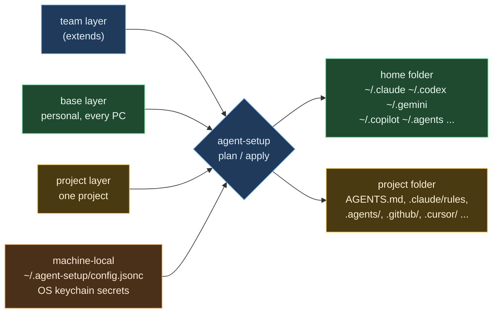

# agent-setup

Keep the configuration of all your AI coding agents in one git repository and apply it to any
machine with one command:

- a **base layer** that follows you to every PC (working rules, skills, slash commands, MCP
  servers, settings),
- **project layers** that are applied to one project folder and purged when the project ends,
- **machine-local values** (paths, secrets) that never enter the repository.

agent-setup renders one source into the native files of Claude Code, OpenAI Codex, Gemini CLI,
Google Antigravity, GitHub Copilot, Cursor, OpenCode, Zed, Junie, Kiro, Amp, Factory Droid,
Devin, Qwen Code, Cline and Goose. It merges only the keys and blocks it owns, so files that the
agents rewrite themselves (`~/.codex/config.toml`, `~/.gemini/settings.json`, `~/.claude.json`)
keep their own content.

Zero dependencies. Node.js 18.17+. Windows, macOS, Linux, WSL.

New here? Start with the [beginner's guide](docs/GUIDE.en.md).

[한국어 문서](README.ko.md) · [처음 사용자 가이드 (한국어)](docs/GUIDE.ko.md)

## Why

| Problem | What agent-setup does |
|---|---|
| Every agent reads instructions, skills and MCP servers from different places and formats | One neutral source, rendered per agent (AGENTS.md, CLAUDE rules, GEMINI.md, Copilot instructions, Cursor `.mdc`, Kiro steering, ...) |
| Personal config is mixed with machine paths and client data | Layers: team/org, personal base, project, machine-local |
| Config files contain absolute paths such as `C:\Users\me\...` | Templates: `{{home}}`, `{{homeSlash}}`, `{{os}}`, `{{vars.x}}`, OS-specific files (`name@windows.ext`) |
| MCP passwords sit in plain text in `.mcp.json` | `${secret:NAME}` stored in the OS keychain; rendered as env references or injected at server start by `agent-setup exec` |
| Agents rewrite their own config files, so symlinks and whole-file sync break | Managed blocks and managed keys; drift detection; backups |
| Client knowledge stays on the machine after the engagement | `project purge` removes rendered files and the agents' per-project transcripts, memories and sessions |

## How it works



Every write is one of three kinds, and agent-setup records what it wrote in
`~/.agent-setup/state.json`:

| Kind | Example | Ownership |
|---|---|---|
| Owned file or folder | `~/.claude/rules/agent-setup/00-core.md`, `~/.agents/skills/<name>/` | the whole file |
| Managed block | `<!-- agent-setup:begin base -->` in `~/.codex/AGENTS.md` | only the block; the rest of the file is kept |
| Managed keys | `mcpServers.<name>` in `~/.gemini/settings.json`, `[mcp_servers.<name>]` in `config.toml` | only those keys; other keys and tables are kept, TOML comments are kept, and JSON files that contain comments are not rewritten without `--force` |

If something was changed outside agent-setup since the last apply (**drift**), or a file already
exists that agent-setup does not own (**conflict**), it is skipped until you pass `--force`; the
original is backed up to `~/.agent-setup/backups/` first.

## Quick start

```sh
# install the CLI (not published to npm yet)
npm install --global github:dongple-ex/agent-setup

# new setup repository from the template
agent-setup init
agent-setup doctor          # which agents are installed, risky configs, plaintext secrets
agent-setup plan --diff     # dry run
agent-setup apply           # write the base layer (asks for confirmation)

# existing repository on a new PC
agent-setup init --from https://github.com/you/my-agent-setup.git
agent-setup secrets check   # which secrets this machine still needs
agent-setup apply
```

Bootstrap scripts that also install git and Node.js: `install/install.ps1` (winget) and
`install/install.sh` (Homebrew or an existing Node.js). Download and read them before running.

Capture what you already have on this machine into the base layer:

```sh
agent-setup import --from claude,codex,gemini,copilot
```

## Setup repository layout

```text
agent-setup.jsonc            targets, extends, vars, options
base/
  instructions/*.md          always-on rules; "paths:" front matter makes a rule path-scoped
  instructions/*.md.tmpl     rules with {{variables}}
  skills/<name>/SKILL.md     Agent Skills (agentskills.io)
  commands/*.md              slash commands using $ARGUMENTS
  agents/*.md                subagents (Claude format)
  mcp/*.jsonc                MCP servers in a neutral format
  settings/<agent>.json|toml key-level settings (claude.json, codex.toml, gemini.json, ...)
  files/<agent>/...          raw files copied into the agent's home folder (files/home/... for ~)
projects/<name>/
  project.jsonc              mode, match rules, vars, memory, purge options
  instructions/ skills/ commands/ agents/ mcp/ settings/ files/project/
```

Neutral MCP definition:

```jsonc
{
  "command": "uvx",
  "args": ["my-mcp-server"],
  "env": { "API_URL": "https://example.com", "API_TOKEN": "${secret:example/token}" },
  "targets": ["claude", "codex", "gemini", "copilot"]   // optional
}
```

## Supported agents

| Agent | User instructions | User skills | User MCP | Project files |
|---|---|---|---|---|
| `claude` Claude Code | `~/.claude/rules/agent-setup/*.md` | `~/.claude/skills` | `claude mcp add-json -s user` | `AGENTS.md`, `.claude/rules`, `.mcp.json` |
| `codex` Codex | `~/.codex/AGENTS.md` (block) | `~/.agents/skills` | `~/.codex/config.toml` | `AGENTS.md`, `.codex/config.toml` (`developer_instructions`) |
| `gemini` Gemini CLI | `~/.gemini/GEMINI.md` (block) | `~/.agents/skills` | `~/.gemini/settings.json` | `AGENTS.md`, `.gemini/settings.json` |
| `antigravity` Antigravity | `~/.gemini/GEMINI.md`, `~/.gemini/config/rules` | `~/.gemini/config/skills`, `~/.gemini/antigravity-cli/skills` | `~/.gemini/config/mcp_config.json` | `.agents/rules`, `.agents/skills`, `.agents/mcp_config.json` |
| `copilot` Copilot CLI / VS Code | `~/.copilot/copilot-instructions.md`, `~/.copilot/instructions` | `~/.agents/skills` | `~/.copilot/mcp-config.json` | `AGENTS.md`, `.github/instructions`, `.mcp.json` |
| `cursor` Cursor | account UI only | `~/.agents/skills` | `~/.cursor/mcp.json` | `.cursor/rules/*.mdc`, `.cursor/mcp.json` |
| `opencode` OpenCode | `~/.config/opencode/AGENTS.md` | `~/.agents/skills` | `opencode.json` `mcp` | `AGENTS.md` |
| `zed` Zed | `%APPDATA%\Zed\AGENTS.md`, `~/.config/zed/AGENTS.md` | `~/.agents/skills` | - | `AGENTS.md` |
| `junie` Junie | `~/.junie/AGENTS.md` | `~/.agents/skills` | `~/.junie/mcp/mcp.json` | `AGENTS.md`, `.junie/rules` |
| `kiro` Kiro | `~/.kiro/steering/*.md` | `~/.kiro/skills` | `~/.kiro/settings/mcp.json` | `.kiro/steering`, `.kiro/skills` |
| `amp`, `factory`, `devin`, `qwen`, `cline`, `goose` | their global `AGENTS.md`-style files | `~/.agents/skills` or their own folder | some | `AGENTS.md` or their rule folders |

Run `agent-setup agents` to see the resolved paths on your machine. Paths for some agents on
Windows are documented only for macOS/Linux by their vendors; treat those as best effort.

## Secrets

```sh
agent-setup secrets set github/token      # prompts without echo; stored in the OS keychain
agent-setup secrets check                 # which referenced secrets are missing here
```

| Where the config lives | How `${secret:NAME}` is rendered |
|---|---|
| Shared project files (committed) | an environment reference in the agent's own syntax (`${VAR}`, `${env:VAR}`, Codex `env_vars` / `bearer_token_env_var`) |
| Home folder or private project files, stdio servers | `node agent-setup exec --env KEY=@@secret:NAME@@ -- <server>`: the value is fetched from the keychain when the server starts and never written to disk |
| Home folder, HTTP servers | an environment reference when the agent supports one; otherwise the server is skipped for that agent with a warning, unless you set `options.secrets.mode` to `"materialize"` (values are then written into that machine-local file and redacted in `plan` output) |

Backends: Windows Credential Manager, macOS Keychain, libsecret (`secret-tool`), 1Password
(`op://` references in `secrets.map`), a plain file for CI, and `AGENT_SETUP_SECRET_<NAME>`
environment overrides.

## Projects

```sh
agent-setup project init acme --mode private --remote "github.com/acme/*"
agent-setup project apply            # inside the project folder; detected by git remote or folder name
agent-setup project purge acme       # at the end of the engagement
```

- **private** mode never edits tracked files. It writes `.claude/rules/agent-setup/project-<name>.md`,
  `.agents/rules/`, `.github/instructions/`, `.cursor/rules/`, Codex `developer_instructions` and
  similar local files, and lists them in `.git/info/exclude`. It deliberately avoids
  `CLAUDE.local.md`: when that file exists, Claude Code stops reading the repository's `AGENTS.md`.
- **shared** mode writes committable files: an `AGENTS.md` block, path-scoped rules for each
  agent, `.mcp.json` with environment references.
- `"memory": { "claude": "project" }` points Claude Code's auto memory into the project folder,
  so it is removed together with the project.
- `project purge` refuses unknown project names, needs `--path` when the project was never applied
  on this machine, refuses drive roots and folders that contain your home folder, and keeps no
  backups of what it deletes (it also deletes earlier backups of that project's files).
- `project purge` removes what agent-setup wrote and the agents' local data for that folder:
  Claude transcripts and memory (or `claude purge`), Gemini CLI `tmp/` and `history/`,
  Antigravity project settings, Codex session rollouts and Copilot session state. Global Codex
  memories and cloud-synced sessions are reported for manual review.

## Commands

| Command | Purpose |
|---|---|
| `init [dir] [--from url]` | create or clone a setup repository and register it |
| `doctor` | environment, installed agents, plaintext secrets, misplaced Codex keys, Zed/Copilot ordering |
| `agents` | supported agents and their resolved paths |
| `plan [--diff] [--all]` / `apply [--yes] [--force] [--prune]` | dry run / write the base layer; `--prune` also removes outputs of agents that are no longer selected |
| `sync` | `git pull --ff-only` the setup repository (and team layers), then apply |
| `status` | managed outputs and drift |
| `project list / init / detect / plan / apply / purge` | project layers |
| `secrets list / check / set / get / delete` | secrets |
| `exec --env K=V -- cmd` | run a command with secrets injected |
| `import` | capture existing user-level config |
| `validate [--strict]` | lint the setup repository (use in CI) |
| `uninstall` | remove everything agent-setup wrote |

Common options: `--only a,b`, `--skip a,b`, `--source <dir>`, `--home <dir>` (sandbox), `--json`.

## Compared with other tools

| Tool | Strength | Gap that agent-setup fills |
|---|---|---|
| rulesync, ruler | many agents, project rules | personal/global layer (ruler), machine-local values, secrets, merging into agent-rewritten files, project purge |
| Microsoft APM | manifest, lockfile, Windows installers | instructions layering per project, private client mode |
| chezmoi | dotfiles, templates, password managers | knowledge of agent formats and locations |
| Claude Code plugins / claude.ai sync | native distribution of skills, commands, MCP | cannot carry CLAUDE.md or rules; Claude only |

agent-setup can sit next to these: keep skills in a Claude plugin marketplace, or let chezmoi
install agent-setup itself.

## Development

```sh
npm test        # node --test, no dependencies
```

Tests run every command against a temporary home folder (`--home`), including git-based
project tests and a TOML editor that preserves comments and foreign tables.

## Status

Prototype (0.1.0). Not yet published to npm; run it with `node bin/agent-setup.js` or
`npx github:dongple-ex/agent-setup` once the repository is public.
