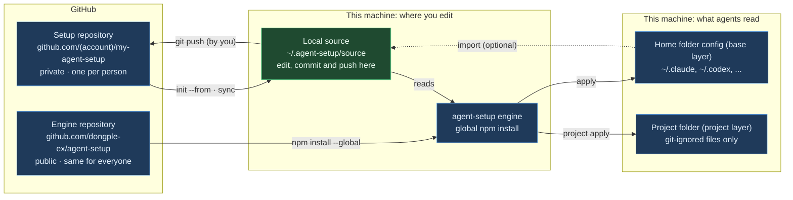

# agent-setup beginner's guide

Written: 2026-10-05 · [한국어](GUIDE.ko.md)

## Before you start

This guide walks a first-time user through agent-setup, from installation to everyday use. If you are new, read PART 1, then follow one of the two scenarios in PART 2 step by step.

| Item | Details |
| --- | --- |
| Audience | People who use two or more AI coding agents (Claude Code, Codex, Gemini CLI, ...) or want the same setup on several machines |
| Version | agent-setup 0.1.0 (prototype) |
| Engine repository | [github.com/dongple-ex/agent-setup](https://github.com/dongple-ex/agent-setup) |
| Tested on | Windows 11. macOS and Linux specific features (keychain storage, file mode preservation) have not been run yet |

| PART | Covers | Read first if you |
| --- | --- | --- |
| 1 Concepts | What the tool does, the terms you need, how the repositories relate | are new to agent-setup |
| 2 First install | Create a new setup repository, bring an existing one to a new machine | are about to install |
| 3 Everyday use | Add rules, skills and MCP servers, per-project settings, syncing machines | have finished installing |
| 4 Checks and troubleshooting | Check commands, FAQ, undo, command summary | ran into a problem |

⚠️ agent-setup is not published to npm yet. Always install from the GitHub spec (`github:dongple-ex/agent-setup`). `npm install agent-setup` with the bare name may install an unrelated package.

---
---

# PART 1 — Concepts

## What agent-setup does

agent-setup is a command-line tool that takes the rules, skills, MCP servers and settings you keep in one git repository and writes them to the locations and formats each AI agent on your machine reads. It is not a plugin of any agent; it is a separate program you run in a terminal.

| Problem without it | With agent-setup |
| --- | --- |
| Every agent uses a different rules file name and location (`CLAUDE.md`, `AGENTS.md`, `GEMINI.md`, ...) | Write once; it is converted to each agent's location |
| A new machine means rebuilding your setup by hand | Restore it from a git repository with a few commands |
| When a client project ends, its settings and conversation history stay behind | Keep per-project settings separate and remove them in one step |
| MCP config files hold passwords in plain text | Passwords live in the OS keychain; config files hold only references |
| It is hard to tell what a change will touch | A dry run (`plan`) shows every change before writing, and overwritten files are backed up |

Sixteen agents are supported: Claude Code, Codex, Gemini CLI, Antigravity, GitHub Copilot CLI, Cursor, OpenCode, Zed, Junie, Kiro, Amp, Factory, Devin, Qwen Code, Cline and Goose. Run `agent-setup agents` to see where each one reads its configuration.

What agent-setup does not do:

- It does not sync agent state such as sign-in data, conversation history or caches.
- It does not commit or push for you. Publishing the repository is your step.
- It never edits files that git tracks in a project repository (private mode).

## Terms you need

These six terms are enough to follow the rest of the guide. The key distinction: **everyone installs the same engine, and everyone keeps their own setup repository**.

| Term | Meaning | Example |
| --- | --- | --- |
| Engine | The `agent-setup` program you install and run | `npm install --global github:dongple-ex/agent-setup` |
| Setup repository | The git repository with the source of your rules, skills, MCP servers and settings. Usually a private GitHub repository | `github.com/<account>/my-agent-setup`, cloned to `~/.agent-setup/source` |
| Base layer | The `base/` folder of the setup repository. Applied on every machine and in every project | Working rules you always follow, skills you use often |
| Project layer | A `projects/<name>/` folder. Applied only in that project folder and removed when the project ends | A client-only MCP server, personal rules for one project |
| Secret reference | `${secret:name}` written in place of a value. The real value is stored in the OS keychain on each machine | `${secret:acme/api-token}` |
| plan / apply | `plan` is a dry run that only shows changes; `apply` writes them | `agent-setup plan --diff`, then `agent-setup apply` |

- The OS keychain is Credential Manager on Windows, Keychain on macOS and libsecret on Linux.
- `~` is your home folder. On Windows it is `C:\Users\<user>`.

## Repositories and the direction of each command



You edit one place, the local source, and agent configuration is generated from it by `apply`. After you edit the local source and run `apply`, the engine writes each agent's own format. `git push` to GitHub and `import` of existing machine settings into the source are steps you run yourself when needed.

A project repository shared with a client or team is separate from this picture. agent-setup does not change what that repository commits; it writes only git-ignored files there (private mode).

---
---

# PART 2 — First install

## Requirements

Node.js and git are required. To share your setup repository between machines you also need a GitHub account.

| Requirement | Why | How to check |
| --- | --- | --- |
| Node.js 18.17 or later | Runs the engine. No other packages are needed | `node --version` |
| git | Downloads the engine and the setup repository from GitHub and keeps them in sync | `git --version` |
| GitHub account | Keeps the setup repository private. Not needed if you use only one machine | Sign in to github.com |
| At least one AI agent | The target of your configuration | `agent-setup doctor` after installing |
| GitHub CLI (`gh`), optional | Convenient for creating the private repository from the command line. The web works too | `gh --version` |

- On Windows the installer (`install.ps1`) installs git and Node.js with winget when they are missing.
- On macOS and Linux the installer (`install.sh`) uses Homebrew or an existing Node.js.
- After installing new programs, open a new terminal so the commands are found. A terminal inside VS Code needs VS Code to be restarted.

## Scenario A: start from scratch

Follow these steps if you do not have a setup repository yet. You create one from a template with examples, replace the examples with your own rules, apply them and push the repository to GitHub.

1. Install the engine.

   ```text
   npm install --global github:dongple-ex/agent-setup
   agent-setup --help
   ```

2. Create the setup repository. The template is copied to `~/.agent-setup/source`, and that folder is registered as your source.

   ```text
   agent-setup init
   ```

3. Check the agents found on this machine and any risky settings. Nothing is written.

   ```text
   agent-setup doctor
   ```

4. Replace the template examples with your own content. PART 3 shows what goes where.
   - Rewrite the three example rules in `base/instructions/`.
   - Delete examples you do not need (`projects/example/`, `base/skills/commit-message/`, ...).
   - `base/mcp/github.jsonc` has `"enabled": false`, so it is not applied unless you change that.
   - To bring in settings you already use, run `agent-setup import` (see the FAQ in PART 4).

5. Preview the changes. Each file is marked as create (`create`), update (`update`) or conflict (`conflict`).

   ```text
   agent-setup plan --diff
   ```

6. Apply. Answer `y` at the prompt to write.

   ```text
   agent-setup apply
   ```

7. Start your agents again and check that the rules are in effect. Rules are read when a session starts.

8. Push the repository to GitHub as a private repository. The commands below assume you are signed in to GitHub CLI.

   ```text
   cd ~/.agent-setup/source
   git init
   git add .
   git commit -m "agent setup"
   gh repo create my-agent-setup --private --source . --remote origin --push
   ```

- Without GitHub CLI, create an empty private repository (no README) on the web, then run `git remote add origin <repository URL>` and `git push -u origin HEAD`.
- The template includes a GitHub Actions workflow (`.github/workflows/validate.yml`) that checks the repository on every push.

⚠️ Do not make the setup repository public. It may contain work rules or client names.

## Scenario B: bring your setup to a new machine

If your setup repository is already on GitHub, one installer script does the work on a new machine. The script installs, clones, checks and previews; you apply after reviewing the result.

Windows (PowerShell):

```text
Invoke-RestMethod https://raw.githubusercontent.com/dongple-ex/agent-setup/main/install/install.ps1 -OutFile install-agent-setup.ps1
powershell -ExecutionPolicy Bypass -File .\install-agent-setup.ps1 -Repo https://github.com/<account>/my-agent-setup.git
```

macOS and Linux:

```text
curl -fsSL https://raw.githubusercontent.com/dongple-ex/agent-setup/main/install/install.sh -o install-agent-setup.sh
sh install-agent-setup.sh https://github.com/<account>/my-agent-setup.git
```

Both scripts do the same steps:

1. Install git and Node.js if they are missing.
2. Install the engine.
3. Clone the setup repository to `~/.agent-setup/source` and register it as your source.
4. Run `doctor`, `secrets check` and `plan` and show the results.

Then store any missing secrets and apply:

```text
agent-setup secrets set <secret name>
agent-setup apply
```

Without the script, run these commands:

```text
npm install --global github:dongple-ex/agent-setup
agent-setup init --from https://github.com/<account>/my-agent-setup.git
agent-setup doctor
agent-setup secrets check
agent-setup plan --diff
agent-setup apply
```

- The first clone of a private repository opens a GitHub sign-in window once.
- The script is downloaded to a file instead of being piped into a shell so you can read it before running it.
- To let the script run apply at the end, add `-Apply` on Windows or set `AGENT_SETUP_APPLY=1` on macOS and Linux. You are still asked to confirm before anything is written.
- Existing settings on the new machine are kept. Rules files get a managed block added, and settings files get only the keys your repository defines.

⚠️ `init --from` stops if `~/.agent-setup/source` already contains files. To use another folder, pass it explicitly: `agent-setup init <folder> --from <URL>`.

---
---

# PART 3 — Everyday use

## Changing rules and skills

Do not edit an agent's config files directly. Edit the setup repository (`~/.agent-setup/source`) and apply. The steps are always the same:

1. Edit files in the setup repository.
2. Check the changes with `agent-setup plan --diff`.
3. Apply with `agent-setup apply`.
4. Commit and push with `git commit` and `git push`.

Use this table to decide where things go. All paths are relative to the setup repository.

| What you want to add | Where | How agents read it |
| --- | --- | --- |
| Rules to follow at all times | `base/instructions/<number>-<name>.md` | Read at the start of every session. Agents that read a single rules file get the files joined in file name order |
| Rules for specific paths only | The same kind of file with `paths:` at the top | Applied per path by agents that support it (Claude, Copilot, Antigravity, ...) |
| Rules with machine-specific values | `base/instructions/<name>.md.tmpl` | `{{home}}`, `{{os}}` and `{{vars.name}}` are replaced with each machine's values |
| Knowledge or procedures needed only sometimes | `base/skills/<name>/SKILL.md` | The agent reads it when the situation in its `description` comes up |
| Slash commands | `base/commands/<name>.md` | Converted to Markdown for Claude and TOML for Gemini |
| Subagents | `base/agents/<name>.md` | Applied to Claude only |
| Agent settings | `base/settings/claude.json`, `codex.toml`, `gemini.json` | Only the keys you write are merged; other existing settings stay |
| OS-specific settings | `@os` suffix, for example `base/settings/claude@windows.json` | Merged only on that OS |
| Files copied as they are | `base/files/<agent>/...` | Copied to the agent's home folder. `.tmpl` files are filled with variables first |

Write skills in the format below. The `description` decides whether a skill is read, so state both what it contains and when to use it. Names use lowercase letters, digits and `-`, up to 64 characters.

```markdown
---
name: commit-message
description: "Commit message rules (subject length, body format). Use when writing a commit message."
---

# Commit message rules

Body
```

- To deploy a skill to specific agents only, add `agent-setup.jsonc` to the skill folder with `{ "targets": ["claude"] }`.
- Keep always-on rules short, since agents read them in every session. Put long, occasional procedures in skills. Codex reads only the first 32 KiB of rules by default.

⚠️ If you edit a file that agent-setup wrote, such as `~/.claude/rules/agent-setup/`, the next apply reports it as changed outside agent-setup (drift) and skips it. Always edit the setup repository.

## MCP servers and secrets

Write an MCP server once in a neutral format in `mcp/<name>.jsonc`, and it is converted to each agent's format. Write passwords and tokens as `${secret:name}` instead of values, and store the real value in the keychain once per machine.

- A server for every project: `base/mcp/<name>.jsonc`
- A server for one project: `projects/<project>/mcp/<name>.jsonc`

A server that runs on your machine (stdio):

```jsonc
{
  "command": "npx",
  "args": ["-y", "example-mcp-server"],
  "env": {
    "EXAMPLE_API_TOKEN": "${secret:example/api-token}"
  }
}
```

A remote server (HTTP). This is `base/mcp/github.jsonc` from the template without the enabled line.

```jsonc
{
  "transport": "http",
  "url": "https://api.githubcopilot.com/mcp/",
  "headers": { "Authorization": "Bearer ${secret:github/token}" },
  "targets": ["claude", "codex", "gemini", "copilot", "cursor"]
}
```

| Key | Meaning |
| --- | --- |
| `command`, `args`, `env` | The command, arguments and environment variables to run on your machine |
| `transport`, `url`, `headers` | How to reach a remote server, its URL and request headers |
| `enabled` | `false` means the server is not applied |
| `targets` | Agents that get this server. Without it, every target of the setup repository gets it |
| `${secret:name}` | A secret stored in the keychain |
| `${env:name}` | An environment variable on this machine |

Manage secrets with these commands. Names may use letters, digits and `_ . / -`; a `project/purpose` style is easy to read.

```text
agent-setup secrets set example/api-token
agent-setup secrets check
agent-setup secrets list
agent-setup secrets delete example/api-token
```

- `secrets set` asks for the value and does not echo what you type.
- `secrets check` lists secrets the setup repository refers to that this machine does not have yet.
- Servers that run on your machine are registered wrapped in `agent-setup exec`. When the server starts, exec reads the values from the keychain and passes them as environment variables.
- Remote servers are registered with environment variable references. Agents that cannot reference environment variables get a warning and the server is not written for them.

Sometimes you do not need the keychain at all:

| Case | What you need |
| --- | --- |
| A server without secrets | Nothing. Just the definition file |
| A remote server that signs in through the browser (OAuth) | Nothing. The agent opens a sign-in window on first use and stores the token itself |
| You prefer environment variables | An `AGENT_SETUP_SECRET_<NAME>` variable. The name is upper-cased and every character other than letters and digits becomes `_`. Example: `example/api-token` → `AGENT_SETUP_SECRET_EXAMPLE_API_TOKEN` |
| You use 1Password | Map the secret name to an `op://` path |

⚠️ A server registered with keychain secrets does not start if agent-setup is uninstalled or the keychain entry is deleted.

## Per-project settings (project layer)

A project layer holds your own settings for one project folder only. Use it to add your rules or MCP servers to a repository you share with a client or team without touching it, and remove everything in one step when the project ends.

1. Create it. `projects/acme/project.jsonc` is added to the setup repository.

   ```text
   agent-setup project init acme --mode private --remote "github.com/acme/*"
   ```

2. Add content. The folders are the same as in base: `projects/acme/instructions/`, `skills/`, `mcp/`.

3. Go to the project folder, preview and apply. Without a name, the project is found from the current folder.

   ```text
   agent-setup project plan --diff
   agent-setup project apply
   ```

4. When the project ends, purge it, then delete `projects/acme/` from the setup repository and commit.

   ```text
   agent-setup project purge acme
   ```

Projects are recognized by the rules below, not by folder path, so the same project is found even if its folder is in a different place on each machine.

| Option | Matches | Example |
| --- | --- | --- |
| `--remote` | The git remote URL. `*` is allowed | `"github.com/acme/*"` |
| `--dir-name` | The folder name. For repositories without a remote | `acme_workspace` |

There are two modes:

| Mode | Files written in the project folder | Use for |
| --- | --- | --- |
| private | Only git-ignored files (`.claude/rules/agent-setup/project-<name>.md`, ...). Their paths are added to `.git/info/exclude` | Client and team repositories. Files that git tracks are never edited |
| shared | Committable files (an `AGENTS.md` block, a `.mcp.json` with environment variable references only) | Repositories you maintain and share with a team |

Settings in `project.jsonc` you will change most often:

| Setting | Meaning |
| --- | --- |
| `"targets": "inherit"` | Use all targets of the setup repository. Write `["claude"]` to apply only to that agent |
| `"memory": { "claude": "project" }` | Keep Claude's auto memory inside the project folder (git-excluded) so it is removed with the folder |
| `"purge": { "agentData": true }` | `purge` also removes this project's agent conversation records |

⚠️ `project purge` is not an undo command. With `agentData` set to `true`, it also removes the project's Claude transcripts and memory, Gemini history and Codex sessions. Add `--keep-agent-data` to keep them.

## Syncing machines and choosing target agents

Push changes from one machine and run `agent-setup sync` on another to reach the same state. `sync` runs `git pull --ff-only` on the setup repository and then applies the base layer.

| Task | Command |
| --- | --- |
| Get changes from another machine and apply | `agent-setup sync` |
| Also update project settings | `agent-setup project apply` in the project folder |
| Apply to some agents this time only | `agent-setup apply --only claude,codex` |
| Skip some agents this time only | `agent-setup apply --skip zed` |
| Also clean up what was written for agents you left out | `agent-setup apply --only claude --prune` |

Three ways to fix the target agents permanently:

| Scope | Where | Example |
| --- | --- | --- |
| Every machine | `targets` in the setup repository's `agent-setup.jsonc` | `"auto"` (agents found on each machine), `"all"`, or `["claude", "codex"]` |
| One project | `targets` in `projects/<name>/project.jsonc` | `["claude"]` |
| This machine only | `targets` in `~/.agent-setup/config.jsonc` | `{ "include": ["cursor"], "exclude": ["zed"] }` |

- With `targets` set to `"auto"`, a newly installed agent is included from the next apply. With an explicit list, add its name.
- Values that differ per machine (a screenshots folder, ...) go under `vars` in `~/.agent-setup/config.jsonc`. That file is not part of the setup repository.
- Some apps rewrite their own config files, the Codex desktop app for example. Run `agent-setup status` now and then and apply again if something changed.

---
---

# PART 4 — Checks and troubleshooting

## Check commands

All of these commands are read-only and safe to run at any time. When something goes wrong, start with `doctor` and `status`.

| Command | Checks | When |
| --- | --- | --- |
| `agent-setup doctor` | Installed agents, plain-text passwords in config files, settings in the wrong place, rules file sizes | After installing, or when something behaves oddly |
| `agent-setup status` | Files agent-setup manages and files changed outside it since the last apply | When you suspect a config file was edited by hand |
| `agent-setup show` | Instructions, skills, MCP servers, setting keys and files in each layer, the agents that receive them, and the project list. `show <name>` details one layer | When you want to see what your setup repository holds at a glance |
| `agent-setup plan --diff` | What an apply would change, line by line | Every time before applying |
| `agent-setup validate` | Format errors, plain-text secrets and invalid skill names in the setup repository | Before committing |
| `agent-setup secrets check` | Secrets the setup repository refers to that this machine lacks | After bringing your setup to a new machine |
| `agent-setup agents` | Each supported agent's config locations and when they were checked | When you want to know where files go |

How to read `plan` output:

| Mark | Meaning | On apply |
| --- | --- | --- |
| `create` | Will be created | Written |
| `update` | Will be changed, including an added managed block or merged keys | Written |
| `unchanged` | Already the same | Nothing happens |
| `conflict` | Overlaps existing content that agent-setup does not manage | Skipped unless you pass `--force` |
| `drift` | Changed outside agent-setup after it was written | Skipped unless you pass `--force` |
| `remove` | Removed from the source and will be cleaned up | Deleted |

- `--force` backs up the original file before overwriting it.
- "Executable content" at the end of `plan` lists commands that will run with your user rights (MCP servers, skill scripts, the status line, ...). Make sure you recognize them.
- Password and token values are shown as `***` in `--diff` output.

## FAQ

**Does `init` put this machine's settings into the setup repository?**

No. `init` only decides which repository is your source. Without `--from` it creates a template with examples; with `--from` it clones an existing repository. The command that brings this machine's existing settings into the repository is `agent-setup import`.

- `import` lists the files it would bring in and writes them to the base layer of the setup repository after you confirm.
- Home paths become variables such as `{{home}}`, and plain-text secrets become `${secret:...}` references.
- Files that already exist in the repository are not overwritten unless you add `--overwrite`.
- After importing, remove duplicates and client information yourself, then commit.

**Is it only for Claude?**

No. It is a separate program that configures sixteen agents from the same repository. Slash commands are converted only for Claude and Gemini, and subagents only for Claude.

**Do I always need the keychain to add an MCP server?**

No. Only servers that need a password or token in their configuration need a one-time `secrets set` per secret on each machine. Servers without secrets, or servers that sign in through the browser, do not.

**What happens if I edit an agent's config file directly?**

If you edited a part agent-setup wrote, the next apply reports it as `drift` and skips it. To keep the change, move it into the setup repository; to discard it, overwrite with `apply --force`. Parts agent-setup did not write are yours to edit freely.

**Will my existing rules files or settings be deleted?**

No. Rules files get a managed block marked "Managed by agent-setup", and settings files get only the keys in your repository merged in. JSON settings files that contain comments are not rewritten without `--force`.

**Are both a project's `AGENTS.md` and my base rules applied?**

Both are read. In case they disagree, state the priority in your base rules, for example "if the project rules say otherwise, follow the project rules". The more they overlap, the more context every session uses.

**Can I keep the setup repository in a synced folder such as Google Drive instead of GitHub?**

It works: register the folder with `agent-setup init <folder>`, and `sync` then skips the pull and only applies. However, conflict copies created by the sync client may be read as rules, and there is no change history, so a private git repository is recommended.

**How do I update the engine?**

Run the install command again. It moves to the latest commit on GitHub.

```text
npm install --global github:dongple-ex/agent-setup
```

## Undo and cautions

Overwritten files are always backed up, so most changes can be undone. The exception is agent conversation records removed by `project purge`.

| Task | How |
| --- | --- |
| Restore a file to its state before apply | Copy the original from `~/.agent-setup/backups/<date-time>/` |
| Remove one rule or skill | Delete it from the setup repository and `apply`. Items removed from the source are cleaned up in agent config too |
| Remove everything from one agent | Take it out of `targets` and run `apply --prune` |
| Remove everything agent-setup wrote | `agent-setup uninstall`. Other content stays |
| Remove the engine too | `agent-setup uninstall`, then `npm uninstall --global agent-setup` |
| Delete a secret | `agent-setup secrets delete <name>` |

Cautions:

- Keep the setup repository private. It may contain work rules and project names.
- Never write passwords or tokens into the setup repository in plain text. Run `validate` before committing.
- Do not apply if "Executable content" in `plan` shows a command you do not recognize. Check this carefully when you pull in someone else's setup repository through `extends`.
- The backup folder keeps config files exactly as they were before being overwritten. If an original held a plain-text password, so does its backup; delete backups once you have checked them.

⚠️ MCP servers registered with keychain secrets stop starting once the engine is removed. Run `uninstall` to clean up the registrations before removing the engine.

## Command summary

Commands marked "yes" in the read-only column write nothing and can be run at any time.

| Group | Command | What it does | Read-only |
| --- | --- | --- | --- |
| Install | `npm install --global github:dongple-ex/agent-setup` | Installs or updates the engine | no |
| Install | `agent-setup init` | Creates a new setup repository from the template and registers it | no |
| Install | `agent-setup init --from <URL>` | Clones an existing setup repository and registers it | no |
| Install | `agent-setup import --from claude,codex` | Brings this machine's existing settings into the setup repository | no |
| base | `agent-setup plan --diff` | Shows what an apply would change | yes |
| base | `agent-setup apply` | Applies the base layer | no |
| base | `agent-setup sync` | Pulls the setup repository, then applies | no |
| base | `agent-setup status` | Shows managed files and files changed outside agent-setup | yes |
| base | `agent-setup show [name]` | Shows what each layer holds and which agents receive it | yes |
| base | `agent-setup uninstall` | Removes everything agent-setup wrote | no |
| project | `agent-setup project init <name> --mode private --remote <URL>` | Creates a project layer | no |
| project | `agent-setup project list` | Lists project layers | yes |
| project | `agent-setup project detect` | Shows which project the current folder belongs to | yes |
| project | `agent-setup project plan --diff` | Previews a project layer | yes |
| project | `agent-setup project apply` | Applies a project layer | no |
| project | `agent-setup project purge <name>` | Removes a project layer and its agent records | no |
| Secrets | `agent-setup secrets set <name>` | Stores a secret in the keychain | no |
| Secrets | `agent-setup secrets check` | Shows secrets missing on this machine | yes |
| Secrets | `agent-setup secrets list` | Lists stored secret names | yes |
| Secrets | `agent-setup secrets delete <name>` | Deletes a secret | no |
| Checks | `agent-setup doctor` | Checks agents and risky settings | yes |
| Checks | `agent-setup validate` | Checks the setup repository | yes |
| Checks | `agent-setup agents` | Shows supported agents and their config locations | yes |

Options shared by many commands:

| Option | Meaning |
| --- | --- |
| `--only a,b` / `--skip a,b` | Apply only to some agents, or leave some out |
| `--yes` | Proceed without confirmation prompts |
| `--force` | Back up and overwrite files in conflict or changed outside agent-setup |
| `--source <folder>` | Use another setup repository instead of the registered one |
| `--home <folder>` | Use another home folder for a trial run without touching your real configuration |
| `--json` / `--quiet` | Machine-readable output / less output |
