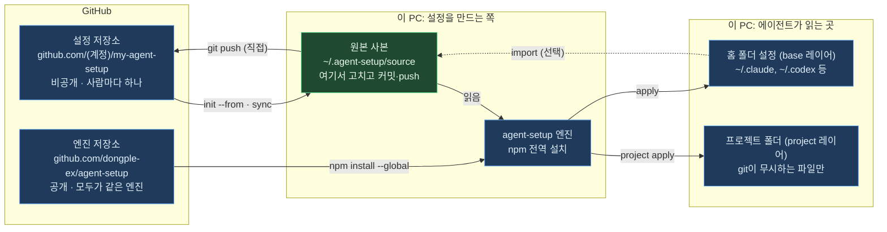

# agent-setup 처음 사용자 가이드

작성일: 2026-10-05

## 읽기 전에

이 문서는 agent-setup을 처음 쓰는 사람이 설치부터 매일 쓰는 방법까지 순서대로 따라 할 수 있게 정리한 안내서입니다. 처음이라면 PART 1을 읽고, PART 2의 시나리오 하나를 그대로 따라 하면 됩니다.

| 항목 | 내용 |
| --- | --- |
| 대상 | Claude Code, Codex, Gemini CLI 같은 AI 코딩 에이전트를 두 개 이상 쓰거나, 여러 PC에서 같은 설정을 쓰고 싶은 사람 |
| 기준 버전 | agent-setup 0.1.0 (프로토타입) |
| 엔진 저장소 | [github.com/dongple-ex/agent-setup](https://github.com/dongple-ex/agent-setup) |
| 검증한 환경 | Windows 11. macOS·Linux 전용 기능(키체인 저장, 파일 권한 보존)은 아직 실행해 보지 않았습니다 |

| PART | 다루는 내용 | 먼저 읽을 사람 |
| --- | --- | --- |
| 1 개념 | 무엇을 하는 도구인지, 꼭 알아야 할 용어, 저장소 사이의 관계 | 처음 접하는 사람 |
| 2 처음 설치 | 설정 저장소를 새로 만들기, 기존 설정을 새 PC로 가져오기 | 설치하려는 사람 |
| 3 매일 쓰기 | 규칙·스킬·MCP 추가, 프로젝트별 설정, 여러 PC 동기화 | 설치를 마친 사람 |
| 4 점검과 문제 해결 | 점검 명령, 자주 묻는 질문, 되돌리기, 명령 요약 | 문제가 생긴 사람 |

⚠️ 아직 npm에 배포하지 않았습니다. 설치할 때는 반드시 GitHub 주소(`github:dongple-ex/agent-setup`)를 씁니다. `npm install agent-setup`처럼 이름만 쓰면 전혀 다른 패키지가 설치될 수 있습니다.

---
---

# PART 1 — 개념

## agent-setup이 하는 일

agent-setup은 git 저장소 하나에 적어 둔 규칙·스킬·MCP 서버·설정을, PC에 설치된 여러 AI 에이전트가 각자 읽는 위치와 형식으로 바꿔 써 주는 명령줄 도구입니다. 특정 에이전트의 플러그인이 아니라 터미널에서 따로 실행하는 프로그램입니다.

| 없을 때의 문제 | agent-setup을 쓰면 |
| --- | --- |
| 에이전트마다 규칙 파일 이름과 위치가 다릅니다 (`CLAUDE.md`, `AGENTS.md`, `GEMINI.md` 등) | 한 곳에 쓰면 각 에이전트의 위치로 변환해 씁니다 |
| PC를 바꾸면 설정을 처음부터 다시 만들어야 합니다 | git 저장소에서 명령 몇 개로 복원합니다 |
| 고객사 프로젝트가 끝나도 그 프로젝트용 설정과 대화 기록이 남습니다 | 프로젝트별 설정을 따로 두고, 끝나면 한 번에 지웁니다 |
| MCP 설정 파일에 비밀번호가 평문으로 남습니다 | 비밀번호는 OS 키체인에 두고, 설정에는 참조만 씁니다 |
| 설정을 바꾸면 무엇이 바뀌는지 알기 어렵습니다 | 쓰기 전에 미리 보기(`plan`)로 바뀌는 내용을 보여 주고, 덮어쓴 파일은 백업합니다 |

대상 에이전트는 16종입니다: Claude Code, Codex, Gemini CLI, Antigravity, GitHub Copilot CLI, Cursor, OpenCode, Zed, Junie, Kiro, Amp, Factory, Devin, Qwen Code, Cline, Goose. 에이전트별 설정 위치는 `agent-setup agents`로 확인합니다.

agent-setup이 하지 않는 일도 있습니다.

- 로그인 정보, 대화 기록, 캐시 같은 에이전트의 상태 파일은 동기화하지 않습니다.
- git commit과 push를 대신 하지 않습니다. 저장소에 올리는 일은 사용자가 직접 합니다.
- 프로젝트 저장소에서 git이 추적하는 파일은 고치지 않습니다(private 모드).

## 꼭 알아야 할 용어

아래 6개만 알면 나머지 설명을 따라갈 수 있습니다. 가장 중요한 구분은 **엔진은 모두가 같은 것을 쓰고, 설정 저장소는 각자 만든다**는 점입니다.

| 용어 | 뜻 | 예 |
| --- | --- | --- |
| 엔진 | 설치해서 실행하는 `agent-setup` 프로그램 | `npm install --global github:dongple-ex/agent-setup` |
| 설정 저장소 | 내 규칙·스킬·MCP·설정의 원본을 담는 git 저장소. 보통 비공개 GitHub 저장소로 둡니다 | `github.com/<계정>/my-agent-setup`, PC에서는 `~/.agent-setup/source` |
| base 레이어 | 설정 저장소의 `base/` 폴더. 모든 PC, 모든 프로젝트에 적용합니다 | 항상 지킬 작업 규칙, 자주 쓰는 스킬 |
| project 레이어 | 설정 저장소의 `projects/<이름>/` 폴더. 그 프로젝트 폴더에서만 적용하고, 끝나면 지웁니다 | 고객사 전용 MCP, 그 프로젝트에서만 쓸 개인 규칙 |
| 비밀값 참조 | 설정에 값 대신 적는 `${secret:이름}`. 실제 값은 PC마다 OS 키체인에 저장합니다 | `${secret:acme/api-token}` |
| plan / apply | `plan`은 바뀔 내용만 보여 주는 미리 보기, `apply`는 실제로 쓰는 적용입니다 | `agent-setup plan --diff` 뒤 `agent-setup apply` |

- OS 키체인은 Windows에서는 자격 증명 관리자, macOS에서는 키체인, Linux에서는 libsecret입니다.
- `~`는 홈 폴더입니다. Windows에서는 `C:\Users\<사용자>`입니다.

## 저장소와 명령의 방향



고치는 곳은 원본 사본 하나이고, 에이전트 설정은 `apply`로 만들어집니다. 원본 사본을 고친 뒤 `apply`를 실행하면 엔진이 각 에이전트의 형식으로 씁니다. GitHub로 올리는 `git push`와, 이 PC의 기존 설정을 원본으로 가져오는 `import`는 필요할 때 사용자가 직접 실행합니다.

고객사나 팀이 함께 쓰는 프로젝트 저장소는 이 그림과 별개입니다. agent-setup은 그 저장소의 커밋 대상을 바꾸지 않고, git이 무시하는 파일에만 씁니다(private 모드).

---
---

# PART 2 — 처음 설치

## 준비물

필수는 Node.js와 git 두 가지입니다. 설정 저장소를 다른 PC와 나눠 쓰려면 GitHub 계정도 필요합니다.

| 준비물 | 필요한 이유 | 확인 방법 |
| --- | --- | --- |
| Node.js 18.17 이상 | 엔진을 실행합니다. 다른 패키지는 필요하지 않습니다 | `node --version` |
| git | 엔진과 설정 저장소를 GitHub에서 내려받고 동기화합니다 | `git --version` |
| GitHub 계정 | 설정 저장소를 비공개로 보관합니다. 한 PC에서만 쓸 때는 없어도 됩니다 | github.com 로그인 |
| AI 에이전트 1개 이상 | 설정을 적용할 대상입니다 | 설치 후 `agent-setup doctor` |
| GitHub CLI(`gh`), 선택 | 비공개 저장소를 명령으로 만들 때 편합니다. 웹에서 만들어도 됩니다 | `gh --version` |

- Windows에서는 설치 스크립트(`install.ps1`)가 git과 Node.js가 없으면 winget으로 설치합니다.
- macOS·Linux에서는 설치 스크립트(`install.sh`)가 Homebrew나 이미 설치된 Node.js를 씁니다.
- 프로그램을 새로 설치한 뒤에는 터미널을 새로 열어야 명령을 찾습니다. VS Code 안의 터미널은 VS Code를 다시 시작해야 합니다.

## 시나리오 A: 처음부터 만들기

설정 저장소가 아직 없다면 이 순서를 따릅니다. 예시가 들어 있는 템플릿으로 저장소를 만들고, 예시를 내 규칙으로 바꾼 뒤 적용하고 GitHub에 올립니다.

1. 엔진을 설치합니다.

   ```text
   npm install --global github:dongple-ex/agent-setup
   agent-setup --help
   ```

2. 설정 저장소를 만듭니다. `~/.agent-setup/source`에 템플릿이 복사되고, 이 폴더가 원본으로 등록됩니다.

   ```text
   agent-setup init
   ```

3. 이 PC에서 찾은 에이전트와 위험한 설정을 점검합니다. 아무것도 쓰지 않습니다.

   ```text
   agent-setup doctor
   ```

4. 템플릿의 예시를 내 내용으로 바꿉니다. 무엇을 어디에 넣는지는 PART 3의 표를 봅니다.
   - `base/instructions/`의 예시 규칙 3개를 내 규칙으로 고칩니다.
   - 필요 없는 예시(`projects/example/`, `base/skills/commit-message/` 등)는 지웁니다.
   - `base/mcp/github.jsonc`는 `"enabled": false`라서 그대로 두면 적용되지 않습니다.
   - 이미 쓰던 설정을 가져오려면 `agent-setup import`를 씁니다(PART 4 자주 묻는 질문 참고).

5. 바뀔 내용을 미리 봅니다. 파일마다 만들기(`create`), 고치기(`update`), 충돌(`conflict`)이 표시됩니다.

   ```text
   agent-setup plan --diff
   ```

6. 적용합니다. 확인 질문에 `y`를 입력하면 씁니다.

   ```text
   agent-setup apply
   ```

7. 에이전트를 새로 시작해서 규칙이 적용되었는지 확인합니다. 규칙은 세션을 시작할 때 읽힙니다.

8. GitHub에 비공개 저장소로 올립니다. 아래는 GitHub CLI에 로그인한 경우입니다.

   ```text
   cd ~/.agent-setup/source
   git init
   git add .
   git commit -m "agent setup"
   gh repo create my-agent-setup --private --source . --remote origin --push
   ```

- GitHub CLI가 없으면 웹에서 README 없이 빈 비공개 저장소를 만든 뒤, `git remote add origin <저장소 주소>`와 `git push -u origin HEAD`를 실행합니다.
- 템플릿에는 push할 때마다 저장소를 검사하는 GitHub Actions(`.github/workflows/validate.yml`)가 들어 있습니다.

⚠️ 설정 저장소는 공개로 만들지 않습니다. 업무 규칙이나 고객사 이름이 들어갈 수 있습니다.

## 시나리오 B: 새 PC에 가져오기

이미 GitHub에 설정 저장소가 있다면 새 PC에서는 설치 스크립트 하나로 끝납니다. 스크립트는 설치, 저장소 복제, 점검, 미리 보기까지 하고, 실제 적용은 결과를 본 뒤 직접 합니다.

Windows(PowerShell):

```text
Invoke-RestMethod https://raw.githubusercontent.com/dongple-ex/agent-setup/main/install/install.ps1 -OutFile install-agent-setup.ps1
powershell -ExecutionPolicy Bypass -File .\install-agent-setup.ps1 -Repo https://github.com/<계정>/my-agent-setup.git
```

macOS·Linux:

```text
curl -fsSL https://raw.githubusercontent.com/dongple-ex/agent-setup/main/install/install.sh -o install-agent-setup.sh
sh install-agent-setup.sh https://github.com/<계정>/my-agent-setup.git
```

두 스크립트가 하는 일은 같습니다.

1. git과 Node.js가 없으면 설치합니다.
2. 엔진을 설치합니다.
3. 설정 저장소를 `~/.agent-setup/source`로 복제하고 원본으로 등록합니다.
4. `doctor`, `secrets check`, `plan`을 차례로 실행해 결과만 보여 줍니다.

그다음 빠진 비밀값을 저장하고 적용합니다.

```text
agent-setup secrets set <비밀값 이름>
agent-setup apply
```

스크립트 없이 직접 할 때는 아래 순서를 따릅니다.

```text
npm install --global github:dongple-ex/agent-setup
agent-setup init --from https://github.com/<계정>/my-agent-setup.git
agent-setup doctor
agent-setup secrets check
agent-setup plan --diff
agent-setup apply
```

- 비공개 저장소를 처음 복제할 때 GitHub 로그인 창이 한 번 뜹니다.
- 스크립트를 바로 실행하지 않고 파일로 내려받는 이유는, 실행하기 전에 내용을 열어 확인할 수 있게 하기 위해서입니다.
- 스크립트가 마지막에 적용까지 실행하게 하려면 Windows에서는 `-Apply`를 붙이고, macOS·Linux에서는 `AGENT_SETUP_APPLY=1`을 설정합니다. 이 경우에도 쓰기 전에 확인 질문은 나옵니다.
- 새 PC에 이미 있던 설정은 지우지 않습니다. 규칙은 관리 블록만 추가하고, 설정 파일은 저장소에 적은 키만 병합합니다.

⚠️ `~/.agent-setup/source`에 이미 파일이 있으면 `init --from`은 멈춥니다. 다른 폴더를 쓰려면 `agent-setup init <폴더> --from <주소>`처럼 폴더를 지정합니다.

---
---

# PART 3 — 매일 쓰기

## 규칙과 스킬 고치기

설정을 바꿀 때는 에이전트의 설정 파일을 직접 고치지 않고, 설정 저장소(`~/.agent-setup/source`)를 고친 뒤 적용합니다. 순서는 항상 같습니다.

1. 설정 저장소의 파일을 고칩니다.
2. `agent-setup plan --diff`로 바뀔 내용을 확인합니다.
3. `agent-setup apply`로 적용합니다.
4. `git commit`, `git push`로 저장소에 올립니다.

무엇을 어디에 넣는지는 아래 표를 따릅니다. 모든 경로는 설정 저장소 기준입니다.

| 넣고 싶은 것 | 넣는 곳 | 에이전트가 읽는 방식 |
| --- | --- | --- |
| 항상 지킬 규칙 | `base/instructions/<번호>-<이름>.md` | 매 세션 시작할 때 읽습니다. 규칙 파일 하나만 읽는 에이전트에는 파일 이름 순서대로 합쳐서 씁니다 |
| 특정 경로에만 적용할 규칙 | 위와 같은 파일 앞부분에 `paths:` 지정 | 지원하는 에이전트(Claude, Copilot, Antigravity 등)만 경로별로 적용합니다 |
| PC마다 다른 값이 들어간 규칙 | `base/instructions/<이름>.md.tmpl` | `{{home}}`, `{{os}}`, `{{vars.이름}}`이 PC별 값으로 바뀝니다 |
| 필요할 때만 읽을 지식·절차 | `base/skills/<이름>/SKILL.md` | 설명(`description`)에 적은 상황이 되면 에이전트가 읽습니다 |
| 슬래시 명령 | `base/commands/<이름>.md` | Claude는 Markdown, Gemini는 TOML로 변환됩니다 |
| 서브에이전트 | `base/agents/<이름>.md` | Claude에만 적용됩니다 |
| 에이전트 설정값 | `base/settings/claude.json`, `codex.toml`, `gemini.json` | 적은 키만 병합하고, 나머지 기존 설정은 그대로 둡니다 |
| 운영체제별 설정값 | `base/settings/claude@windows.json` 처럼 `@운영체제` | 그 운영체제에서만 병합됩니다 |
| 그대로 복사할 파일 | `base/files/<에이전트>/...` | 에이전트 홈 폴더로 복사됩니다. `.tmpl`은 변수를 채운 뒤 복사합니다 |

스킬은 아래 형식으로 씁니다. `description`이 스킬을 읽을지 판단하는 기준이므로, 무엇을 담았는지와 언제 쓰는지를 함께 적습니다. 이름은 64자 이내로 영문 소문자, 숫자, `-`만 씁니다.

```markdown
---
name: commit-message
description: "커밋 메시지 작성 규칙(제목 길이, 본문 형식). 커밋 메시지를 쓸 때 사용한다."
---

# 커밋 메시지 규칙

본문
```

- 특정 에이전트에만 배포하려면 스킬 폴더에 `agent-setup.jsonc`를 만들고 `{ "targets": ["claude"] }`처럼 적습니다.
- 항상 지킬 규칙은 에이전트가 매 세션 읽으므로 짧게 유지합니다. 길고 가끔 필요한 절차는 스킬로 둡니다. Codex는 규칙 파일을 기본 32 KiB까지만 읽습니다.

⚠️ `~/.claude/rules/agent-setup/`처럼 agent-setup이 쓴 파일을 직접 고치면, 다음 적용 때 "바깥에서 바뀐 파일(drift)"로 보고 건너뜁니다. 항상 설정 저장소를 고칩니다.

## MCP 서버와 비밀값

MCP 서버는 `mcp/<이름>.jsonc`에 중립 형식으로 한 번만 적으면 각 에이전트의 형식으로 변환됩니다. 비밀번호나 토큰은 값 대신 `${secret:이름}`으로 적고, 실제 값은 PC마다 키체인에 한 번 저장합니다.

- 모든 프로젝트에서 쓸 서버: `base/mcp/<이름>.jsonc`
- 한 프로젝트에서만 쓸 서버: `projects/<프로젝트>/mcp/<이름>.jsonc`

PC에서 실행하는 서버(stdio)의 예입니다.

```jsonc
{
  "command": "npx",
  "args": ["-y", "example-mcp-server"],
  "env": {
    "EXAMPLE_API_TOKEN": "${secret:example/api-token}"
  }
}
```

원격 서버(HTTP)의 예입니다. 설정 저장소 템플릿의 `base/mcp/github.jsonc`에서 enabled 줄을 뺀 형태입니다.

```jsonc
{
  "transport": "http",
  "url": "https://api.githubcopilot.com/mcp/",
  "headers": { "Authorization": "Bearer ${secret:github/token}" },
  "targets": ["claude", "codex", "gemini", "copilot", "cursor"]
}
```

| 키 | 뜻 |
| --- | --- |
| `command`, `args`, `env` | PC에서 실행할 명령, 인자, 환경 변수 |
| `transport`, `url`, `headers` | 원격 서버의 연결 방식과 주소, 요청 헤더 |
| `enabled` | `false`면 적용하지 않습니다 |
| `targets` | 이 서버를 적용할 에이전트. 없으면 설정 저장소의 전체 대상에 적용합니다 |
| `${secret:이름}` | 키체인에 저장한 비밀값 |
| `${env:이름}` | 이 PC의 환경 변수 |

비밀값은 아래 명령으로 다룹니다. 이름에는 영문, 숫자, `_ . / -`를 쓸 수 있고, `프로젝트/용도`처럼 지으면 알아보기 쉽습니다.

```text
agent-setup secrets set example/api-token
agent-setup secrets check
agent-setup secrets list
agent-setup secrets delete example/api-token
```

- `secrets set`은 값을 물어보고, 입력한 값은 화면에 보이지 않습니다.
- `secrets check`는 설정 저장소가 참조하는데 이 PC에 아직 없는 비밀값을 보여 줍니다.
- PC에서 실행하는 서버는 `agent-setup exec`로 감싸서 등록됩니다. 서버가 시작될 때 exec가 키체인에서 값을 읽어 환경 변수로 넘깁니다.
- 원격 서버는 환경 변수 참조로 등록됩니다. 환경 변수 참조를 지원하지 않는 에이전트에는 경고를 내고 쓰지 않습니다.

키체인이 필요 없는 경우도 있습니다.

| 경우 | 필요한 것 |
| --- | --- |
| 비밀값이 없는 서버 | 없음. 정의 파일만 만듭니다 |
| 브라우저 로그인(OAuth)으로 인증하는 원격 서버 | 없음. 처음 연결할 때 에이전트가 로그인 창을 띄우고 토큰을 직접 보관합니다 |
| 환경 변수로 관리하고 싶을 때 | `AGENT_SETUP_SECRET_<이름>` 환경 변수. 이름은 대문자로 바꾸고 영문·숫자 외의 문자는 `_`로 바꿉니다. 예: `example/api-token` → `AGENT_SETUP_SECRET_EXAMPLE_API_TOKEN` |
| 1Password를 쓸 때 | 비밀값 이름을 `op://` 경로로 연결합니다 |

⚠️ 키체인 방식으로 등록한 서버는 agent-setup을 지우거나 키체인 항목을 지우면 시작되지 않습니다.

## 프로젝트별 설정(project 레이어)

project 레이어는 특정 프로젝트 폴더에서만 쓰는 내 설정입니다. 고객사 저장소처럼 팀이 함께 쓰는 저장소를 건드리지 않고 내 규칙이나 MCP를 더할 때 쓰고, 프로젝트가 끝나면 한 번에 지웁니다.

1. 만듭니다. 설정 저장소에 `projects/acme/project.jsonc`가 생깁니다.

   ```text
   agent-setup project init acme --mode private --remote "github.com/acme/*"
   ```

2. 내용을 넣습니다. 폴더 구성은 base와 같습니다: `projects/acme/instructions/`, `skills/`, `mcp/`.

3. 프로젝트 폴더로 이동해서 미리 보고 적용합니다. 이름을 생략하면 현재 폴더로 프로젝트를 찾습니다.

   ```text
   agent-setup project plan --diff
   agent-setup project apply
   ```

4. 프로젝트가 끝나면 지우고, 설정 저장소에서도 `projects/acme/`를 지운 뒤 커밋합니다.

   ```text
   agent-setup project purge acme
   ```

프로젝트는 폴더 경로가 아니라 아래 기준으로 찾습니다. 그래서 PC마다 폴더 위치가 달라도 같은 프로젝트로 인식합니다.

| 옵션 | 기준 | 예 |
| --- | --- | --- |
| `--remote` | git 원격 주소. `*`를 쓸 수 있습니다 | `"github.com/acme/*"` |
| `--dir-name` | 폴더 이름. 원격 주소가 없는 저장소에 씁니다 | `acme_workspace` |

모드는 두 가지입니다.

| 모드 | 프로젝트 폴더에 쓰는 파일 | 쓰는 경우 |
| --- | --- | --- |
| private | git이 무시하는 파일만 씁니다(`.claude/rules/agent-setup/project-<이름>.md` 등). 그 경로는 `.git/info/exclude`에 등록합니다 | 고객사·팀 저장소. git이 추적하는 파일은 고치지 않습니다 |
| shared | 커밋할 수 있는 파일을 씁니다(`AGENTS.md` 블록, 환경 변수 참조만 들어간 `.mcp.json`) | 내가 관리하고 팀과 함께 쓰는 저장소 |

`project.jsonc`에서 자주 바꾸는 항목입니다.

| 항목 | 뜻 |
| --- | --- |
| `"targets": "inherit"` | 설정 저장소 전체 대상을 따릅니다. `["claude"]`처럼 적으면 그 에이전트에만 적용합니다 |
| `"memory": { "claude": "project" }` | Claude 자동 메모리를 프로젝트 폴더 안(git 제외)에 두어, 폴더와 함께 지울 수 있게 합니다 |
| `"purge": { "agentData": true }` | `purge`할 때 그 프로젝트의 에이전트 대화 기록도 함께 지웁니다 |

⚠️ `project purge`는 되돌리기용 명령이 아닙니다. `agentData`가 `true`이면 그 프로젝트의 Claude 대화 기록과 메모리, Gemini 기록, Codex 세션 기록까지 지웁니다. 기록을 남기려면 `--keep-agent-data`를 붙입니다.

## 여러 PC 동기화와 적용 대상 조절

한 PC에서 고친 설정을 push하고, 다른 PC에서 `agent-setup sync`를 실행하면 같은 상태가 됩니다. `sync`는 설정 저장소를 `git pull --ff-only`한 뒤 base 레이어를 적용합니다.

| 하는 일 | 명령 |
| --- | --- |
| 다른 PC의 변경을 받아 적용 | `agent-setup sync` |
| 프로젝트 설정까지 반영 | 프로젝트 폴더에서 `agent-setup project apply` |
| 이번 한 번만 일부 에이전트에 적용 | `agent-setup apply --only claude,codex` |
| 이번 한 번만 일부 에이전트 제외 | `agent-setup apply --skip zed` |
| 제외한 에이전트에 이미 쓴 내용까지 정리 | `agent-setup apply --only claude --prune` |

적용 대상을 계속 고정하는 방법은 세 가지입니다.

| 범위 | 설정 위치 | 예 |
| --- | --- | --- |
| 모든 PC | 설정 저장소 `agent-setup.jsonc`의 `targets` | `"auto"`(각 PC에서 찾은 에이전트), `"all"`, 또는 `["claude", "codex"]` |
| 한 프로젝트 | `projects/<이름>/project.jsonc`의 `targets` | `["claude"]` |
| 이 PC만 | `~/.agent-setup/config.jsonc`의 `targets` | `{ "include": ["cursor"], "exclude": ["zed"] }` |

- 새 에이전트를 설치했을 때 `targets`가 `"auto"`이면 다음 적용부터 자동으로 포함됩니다. 목록으로 적었다면 이름을 추가합니다.
- PC마다 다른 값(스크린샷 폴더 등)은 `~/.agent-setup/config.jsonc`의 `vars`에 둡니다. 이 파일은 설정 저장소에 들어가지 않습니다.
- Codex 데스크톱 앱처럼 앱이 설정 파일을 다시 쓰는 경우가 있습니다. 가끔 `agent-setup status`로 확인하고, 바뀐 것이 있으면 다시 적용합니다.

---
---

# PART 4 — 점검과 문제 해결

## 점검 명령

아래 명령은 모두 읽기 전용이라 언제 실행해도 안전합니다. 문제가 생기면 `doctor`와 `status`부터 실행합니다.

| 명령 | 확인하는 것 | 쓰는 때 |
| --- | --- | --- |
| `agent-setup doctor` | 설치된 에이전트, 설정 파일의 평문 비밀번호, 잘못된 위치에 들어간 설정, 규칙 파일 크기 | 처음 설치할 때, 동작이 이상할 때 |
| `agent-setup status` | agent-setup이 관리하는 파일 목록과, 적용한 뒤 바깥에서 바뀐 파일 | 설정 파일을 직접 고친 것 같을 때 |
| `agent-setup plan --diff` | 적용하면 바뀔 내용과 줄 단위 차이 | 적용하기 전에 항상 |
| `agent-setup validate` | 설정 저장소의 형식 오류, 평문 비밀값, 잘못된 스킬 이름 | 커밋하기 전 |
| `agent-setup secrets check` | 설정 저장소가 참조하는데 이 PC에 없는 비밀값 | 새 PC에 가져왔을 때 |
| `agent-setup agents` | 지원 에이전트별 설정 위치와 확인일 | 파일이 어디에 쓰이는지 궁금할 때 |

`plan` 결과의 표시는 다음과 같이 읽습니다.

| 표시 | 뜻 | 적용할 때 |
| --- | --- | --- |
| `create` | 새로 만듭니다 | 씁니다 |
| `update` | 고칩니다. 관리 블록 추가나 키 병합도 여기에 들어갑니다 | 씁니다 |
| `unchanged` | 이미 같습니다 | 아무것도 하지 않습니다 |
| `conflict` | agent-setup이 관리하지 않는 기존 내용과 겹칩니다 | `--force`를 주기 전에는 건너뜁니다 |
| `drift` | agent-setup이 쓴 뒤 바깥에서 바뀌었습니다 | `--force`를 주기 전에는 건너뜁니다 |
| `remove` | 원본에서 지운 항목을 정리합니다 | 지웁니다 |

- `--force`를 주면 원래 파일을 백업한 뒤 덮어씁니다.
- `plan` 결과 끝의 "Executable content"는 적용하면 내 권한으로 실행될 명령(MCP 서버, 스킬 스크립트, 상태 표시줄 등)입니다. 내가 아는 명령인지 확인합니다.
- `--diff` 출력에서 비밀번호·토큰 계열 값은 `***`로 가려집니다.

## 자주 묻는 질문

**`init`을 하면 이 PC의 설정이 설정 저장소에 들어가나요?**

아닙니다. `init`은 어느 저장소를 원본으로 쓸지 정하는 명령입니다. `--from` 없이 실행하면 예시만 든 템플릿을 만들고, `--from`을 주면 기존 저장소를 복제합니다. 이 PC의 기존 설정을 저장소로 가져오는 명령은 `agent-setup import`입니다.

- `import`는 가져올 파일 목록을 먼저 보여 주고, 확인을 받은 뒤 설정 저장소의 base 레이어에 씁니다.
- 홈 경로는 `{{home}}` 같은 변수로, 평문 비밀값은 `${secret:...}` 참조로 바뀝니다.
- 저장소에 같은 파일이 있으면 덮어쓰지 않습니다. 덮어쓰려면 `--overwrite`를 붙입니다.
- 가져온 뒤에는 중복된 내용과 고객사 정보를 직접 걸러 내고 커밋합니다.

**Claude에서만 쓰는 도구인가요?**

아닙니다. 터미널에서 따로 실행하는 프로그램이고, 16종 에이전트를 같은 저장소로 설정합니다. 슬래시 명령은 Claude와 Gemini에만, 서브에이전트는 Claude에만 변환됩니다.

**MCP를 붙이려면 항상 키체인을 설정해야 하나요?**

아닙니다. 비밀번호나 토큰을 설정에 넣어야 하는 서버만 비밀값마다 PC당 한 번 `secrets set`을 합니다. 비밀값이 없거나 브라우저 로그인으로 인증하는 서버는 필요 없습니다.

**에이전트 설정 파일을 직접 고치면 어떻게 되나요?**

agent-setup이 쓴 부분을 고쳤다면 다음 적용 때 `drift`로 보고 건너뜁니다. 그 변경을 유지하려면 같은 내용을 설정 저장소에 옮기고, 버리려면 `apply --force`로 덮어씁니다. agent-setup이 쓰지 않은 부분은 자유롭게 고쳐도 됩니다.

**기존에 쓰던 규칙 파일이나 설정이 지워지나요?**

지워지지 않습니다. 규칙 파일에는 "Managed by agent-setup" 표시가 붙은 관리 블록만 추가하고, 설정 파일은 저장소에 적은 키만 병합합니다. 주석이 들어 있는 JSON 설정 파일은 `--force` 없이는 다시 쓰지 않습니다.

**프로젝트 저장소의 `AGENTS.md`와 내 base 규칙이 둘 다 적용되나요?**

둘 다 읽힙니다. 두 규칙이 다를 때를 대비해 base 규칙에 "프로젝트 규칙이 다르게 정하면 프로젝트 규칙을 따른다"처럼 우선순위를 적어 둡니다. 겹치는 내용이 많으면 매 세션의 컨텍스트 사용량이 그만큼 늘어납니다.

**설정 저장소를 GitHub 대신 Google Drive 같은 폴더에 두어도 되나요?**

동작은 합니다. `agent-setup init <폴더>`로 등록하면 되고, 이때 `sync`는 pull을 건너뛰고 적용만 합니다. 다만 동기화 충돌로 생긴 사본 파일이 규칙으로 읽힐 수 있고 변경 이력도 남지 않아서, git 비공개 저장소를 권합니다.

**엔진은 어떻게 업데이트하나요?**

설치 명령을 다시 실행합니다. GitHub의 최신 커밋으로 바뀝니다.

```text
npm install --global github:dongple-ex/agent-setup
```

## 되돌리기와 주의 사항

덮어쓴 파일은 항상 백업되므로, 적용한 내용은 대부분 되돌릴 수 있습니다. 예외는 `project purge`로 지운 에이전트 대화 기록입니다.

| 하고 싶은 일 | 방법 |
| --- | --- |
| 적용하기 전 파일로 돌리기 | `~/.agent-setup/backups/<날짜-시각>/`에서 원본을 복사합니다 |
| 규칙이나 스킬 하나 빼기 | 설정 저장소에서 지우고 `apply`합니다. 원본에서 지운 항목은 에이전트 설정에서도 정리됩니다 |
| 한 에이전트에서 모두 빼기 | `targets`에서 뺀 뒤 `apply --prune`을 실행합니다 |
| agent-setup이 쓴 내용을 전부 지우기 | `agent-setup uninstall`. 다른 내용은 남깁니다 |
| 엔진까지 제거하기 | `agent-setup uninstall` 뒤 `npm uninstall --global agent-setup` |
| 비밀값 지우기 | `agent-setup secrets delete <이름>` |

주의할 점입니다.

- 설정 저장소는 비공개로 둡니다. 업무 규칙과 프로젝트 이름이 들어갈 수 있습니다.
- 비밀번호나 토큰을 설정 저장소에 평문으로 적지 않습니다. 커밋 전에 `validate`로 검사합니다.
- `plan`의 "Executable content"에 모르는 명령이 있으면 적용하지 않습니다. 남이 만든 설정 저장소를 `extends`로 가져올 때 특히 확인합니다.
- 백업 폴더에는 덮어쓰기 전 설정 파일이 그대로 남습니다. 원래 파일에 평문 비밀번호가 있었다면 백업에도 남으므로, 확인이 끝나면 지웁니다.

⚠️ 키체인 방식으로 등록한 MCP 서버는 엔진을 제거하면 시작되지 않습니다. 엔진을 지우기 전에 `uninstall`로 등록을 먼저 정리합니다.

## 명령 한눈에 보기

읽기 전용 열이 "예"인 명령은 아무것도 쓰지 않으므로 언제든 실행해도 됩니다.

| 분류 | 명령 | 하는 일 | 읽기 전용 |
| --- | --- | --- | --- |
| 설치 | `npm install --global github:dongple-ex/agent-setup` | 엔진을 설치하거나 최신으로 바꿉니다 | 아니오 |
| 설치 | `agent-setup init` | 템플릿으로 새 설정 저장소를 만들고 등록합니다 | 아니오 |
| 설치 | `agent-setup init --from <주소>` | 기존 설정 저장소를 복제하고 등록합니다 | 아니오 |
| 설치 | `agent-setup import --from claude,codex` | 이 PC의 기존 설정을 설정 저장소로 가져옵니다 | 아니오 |
| base | `agent-setup plan --diff` | 적용하면 바뀔 내용을 보여 줍니다 | 예 |
| base | `agent-setup apply` | base 레이어를 적용합니다 | 아니오 |
| base | `agent-setup sync` | 설정 저장소를 pull한 뒤 적용합니다 | 아니오 |
| base | `agent-setup status` | 관리 중인 파일과 바깥에서 바뀐 파일을 보여 줍니다 | 예 |
| base | `agent-setup uninstall` | agent-setup이 쓴 내용을 모두 지웁니다 | 아니오 |
| project | `agent-setup project init <이름> --mode private --remote <주소>` | 프로젝트 레이어를 만듭니다 | 아니오 |
| project | `agent-setup project list` | 프로젝트 레이어 목록을 보여 줍니다 | 예 |
| project | `agent-setup project detect` | 현재 폴더가 어느 프로젝트인지 보여 줍니다 | 예 |
| project | `agent-setup project plan --diff` | 프로젝트 레이어를 미리 봅니다 | 예 |
| project | `agent-setup project apply` | 프로젝트 레이어를 적용합니다 | 아니오 |
| project | `agent-setup project purge <이름>` | 프로젝트 레이어와 에이전트 기록을 지웁니다 | 아니오 |
| 비밀값 | `agent-setup secrets set <이름>` | 비밀값을 키체인에 저장합니다 | 아니오 |
| 비밀값 | `agent-setup secrets check` | 이 PC에 없는 비밀값을 보여 줍니다 | 예 |
| 비밀값 | `agent-setup secrets list` | 저장한 비밀값 이름을 보여 줍니다 | 예 |
| 비밀값 | `agent-setup secrets delete <이름>` | 비밀값을 지웁니다 | 아니오 |
| 점검 | `agent-setup doctor` | 에이전트와 위험한 설정을 점검합니다 | 예 |
| 점검 | `agent-setup validate` | 설정 저장소를 검사합니다 | 예 |
| 점검 | `agent-setup agents` | 지원 에이전트와 설정 위치를 보여 줍니다 | 예 |

여러 명령에 공통으로 붙는 옵션입니다.

| 옵션 | 뜻 |
| --- | --- |
| `--only a,b` / `--skip a,b` | 일부 에이전트에만 적용하거나 일부를 뺍니다 |
| `--yes` | 확인 질문 없이 진행합니다 |
| `--force` | 충돌·변경된 파일도 백업한 뒤 덮어씁니다 |
| `--source <폴더>` | 등록된 것 대신 다른 설정 저장소를 씁니다 |
| `--home <폴더>` | 홈 폴더를 바꿔서 시험합니다. 실제 설정을 건드리지 않고 연습할 때 씁니다 |
| `--json` / `--quiet` | 기계가 읽는 출력 / 출력 줄이기 |
